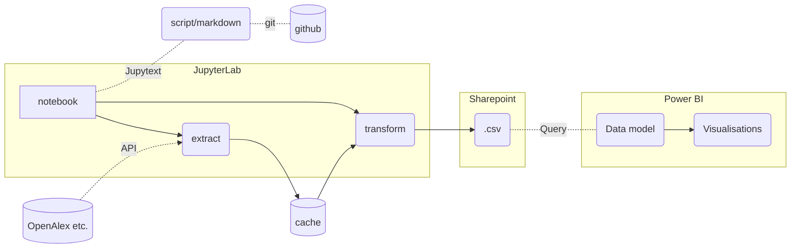

## RI projects template

### RI workflow

This template is for (standard) RI projects, using **JupyterLab** for development with **Jupytext** for easier version control.

The standard workflow is shown in the flowchart below:




The repository has only one subfolder (/scripts) that contains converted notebooks (in markdown format).\
*(see jupytext section below for instructions on how to use the notebooks)*

### environment.yml

- conda environment with essential libraries
- can be used as a "global" environment because most of the libraries are reused across projects

install and activate the environment
```
conda env create --file environment.yml
conda activate ri
```
after use
```
conda deactivate ri
```
https://docs.conda.io/en/latest/miniconda.html

### jupytext.toml

Configures Jupytext

- /scripts contains converted notebooks; metadata is removed so that it does not interfere with git
- the markdown format allows github to render the notebook as it would any other .md file
- when opened as a notebook (in JupyterLab), Jupytext creates an .ipynb file under /notebooks
- this notebook can be run and modified and when saved, the notebook is converted and saved under /scripts
- the notebooks themselves are gitignored

use the following command to create all notebooks from scripts at once:
```
jupytext --sync scripts/*
```

https://jupytext.readthedocs.io/en/latest/index.html

### configTEMPLATE.json
- contains credentials, e.g. api keys or path to data
- path to data can be local, but ideally it is shared with the team (sharepoint)
- make sure to remove the substring TEMPLATE in a local repository
